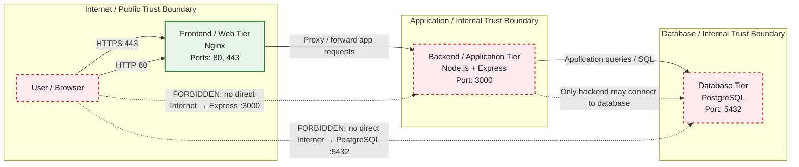

# PostureSec 3-Tier Architecture

This architecture keeps the public attack surface limited to the frontend web tier. The backend application tier and database tier remain inside private security zones and are never directly reachable from the Internet.

## Primary traffic flow

User/Browser → Nginx :443/:80 → Express :3000 → PostgreSQL :5432

## Trust boundaries and security controls

- Internet / Public trust boundary:
  - Only the Nginx frontend is public-facing.
  - HTTPS terminates at Nginx on port 443.
  - HTTP is exposed on port 80 only as an entry point to the public web tier.

- Application / Internal trust boundary:
  - The Express backend listens on port 3000.
  - Port 3000 is not directly exposed to the Internet.
  - Requests from the frontend are proxied to the backend only.

- Database / Internal trust boundary:
  - PostgreSQL listens on port 5432.
  - The database is internal-only and must never be directly reachable from the public Internet.
  - Only the Express application tier may connect to PostgreSQL.

> PostgreSQL :5432 is internal-only. It must never be exposed to the public Internet; only the Express backend may connect to the database.

## Security summary

- Nginx is the only public-facing tier.
- No direct Internet → Express :3000 connection is allowed.
- No direct Internet → PostgreSQL :5432 connection is allowed.
- Database access is restricted to the backend/application tier only.
