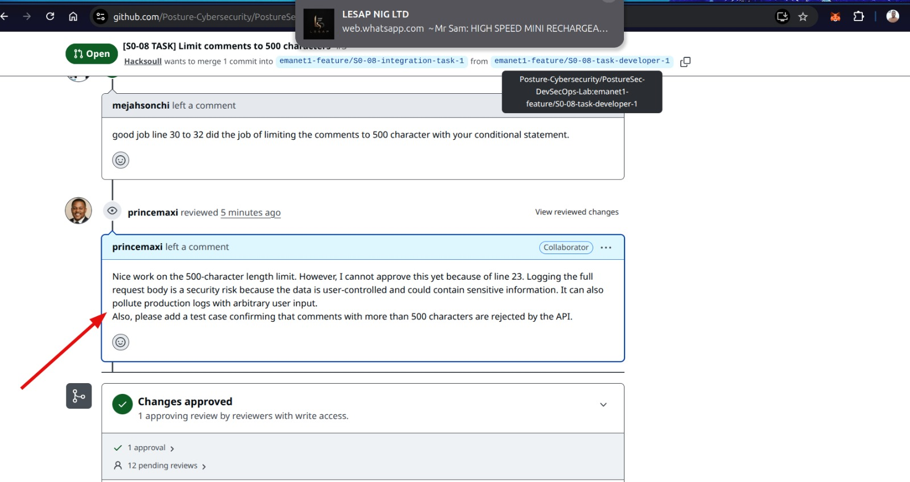

# How To Review a Teammates's Pull Request(PR) (with AI Best Practices) - ONB-008

A strong PR review protects the codebase, catches bugs early, and raises the team’s standard. Modern reviews also use AI as a **force multiplier** — never as a replacement for human judgment.

## 1. Start with Context

Before looking at code:

- Read the PR title, description, and linked ticket
- Understand **why** the change exists
- Note the size and scope

Ask: *Does this change match the stated goal?*

**AI tip:** Paste the PR link/description + ticket into an AI or use AI Agents and ask:  
“Summarize the intent of this change and list potential risks.”

## 2. High-Level Scan

- What files changed?
- Is the scope focused or is unrelated work mixed in?
- Any new dependencies, config, or infrastructure?
- Does it touch auth, user data, secrets, or logging?

**AI tip:** Ask the AI to list every file changed and highlight anything security-sensitive.

## 3. Security Checklist (Non-Negotiable)

| Check              | What to look for                                      |
|--------------------|-------------------------------------------------------|
| Secrets            | Hardcoded passwords, API keys, tokens                 |
| Logging            | Full request bodies or user-controlled data           |
| Input validation   | Missing length limits, sanitization                   |
| Auth / AuthZ       | Missing auth middleware, broken ownership checks      |
| Injection          | Non-parameterized queries, command injection          |
| Screenshots / Docs | Private keys, emails, credentials visible             |
| Dependencies       | New packages with known issues                        |

**AI tip:** Feed the diff to an AI with a prompt like:  
“Act as a security reviewer. Flag any secrets, unsafe logging, missing validation, or injection risks in this diff.”

Always verify the AI’s findings yourself — false positives and missed context are common.

## 4. Code Quality & Correctness

- Does the logic solve the actual problem?
- Are edge cases and error paths handled?
- Is the code readable and consistent with existing style?
- Are there tests for both success and failure cases?

**AI tip:** Ask the AI to:
- Explain complex logic in plain language
- Suggest missing edge cases
- Point out style or maintainability issues

Never accept AI-generated code suggestions without understanding them.

## 5. Tests & Evidence

- Do existing tests still pass?
- Are new behaviors covered (including negative cases)?
- Is there clear evidence the author verified the change?

**AI tip:** Ask the AI to generate a list of test cases the PR should cover, then check whether those tests exist.

## 6. Leave Clear, Actionable Comments

Good comments:

- Point to the exact line
- Explain the risk
- Suggest a concrete fix
- Stay professional

**Example:**

```text
Security note: please remove `console.log('new comment', req.body)`.

Logging the full request body (user-controlled content) is a risk — 
it can pollute logs or leak sensitive data.

The 500-char limit itself looks good. Consider adding a test that 
rejects content > 500 chars.
```
**AI tip:** You can draft comments with AI, but always edit them so they sound human and match the team’s tone.



## 7. Decide on the Outcome

- **Approve** – clean and low risk
- **Request changes** – must fix before merge
- **Comment only** – non-blocking questions or suggestions

## Recommended Review Flow

1. Read description & ticket  
2. High-level scan of files and scope  
3. Run security checklist (use AI as a second pair of eyes)  
4. Review logic, edge cases, and tests  
5. Verify AI findings manually  
6. Leave clear comments  
7. Approve or request changes  

## Best Practices When Using AI for Reviews

| Do                                        | Don’t                                                 |
|-------------------------------------------|-------------------------------------------------------|
| Use AI to surface risks and missing tests | Blindly trust AI output                               |
| Verify every security finding yourself    | Paste secrets or private code into public AI tools    |
| Keep the final judgment human             | Let AI write the entire review without editing        |
| Use AI to explain unfamiliar code         | Accept AI-generated fixes you don’t understand        |
| Treat AI as a junior reviewer             | Skip the human review because “AI already checked it” |

## Quick Mental Model

> - AI finds candidates.  
> - You decide what actually matters.  
> - You own the final review.