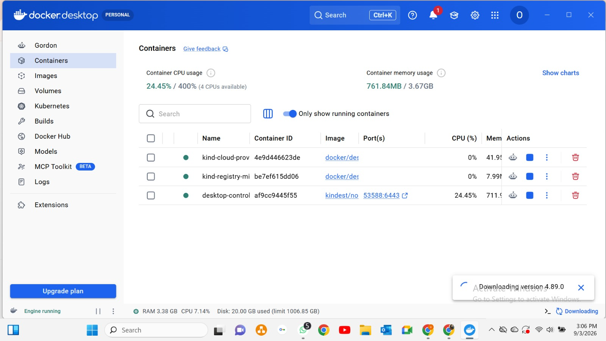
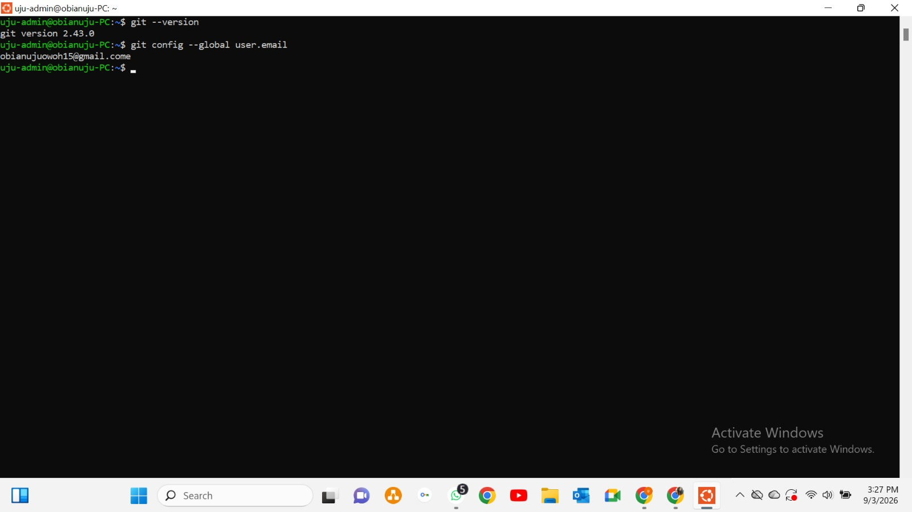
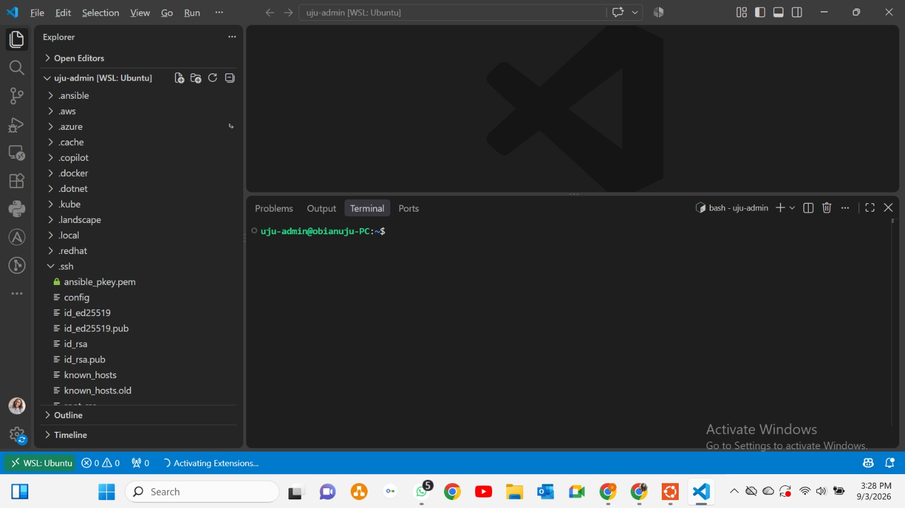
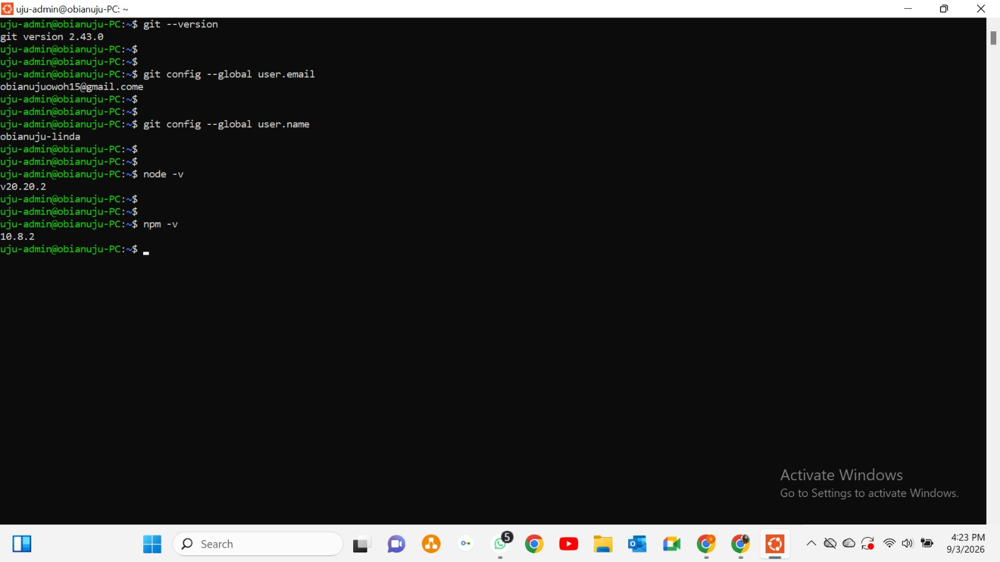
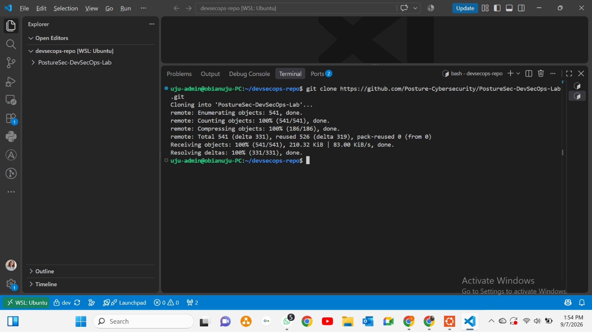
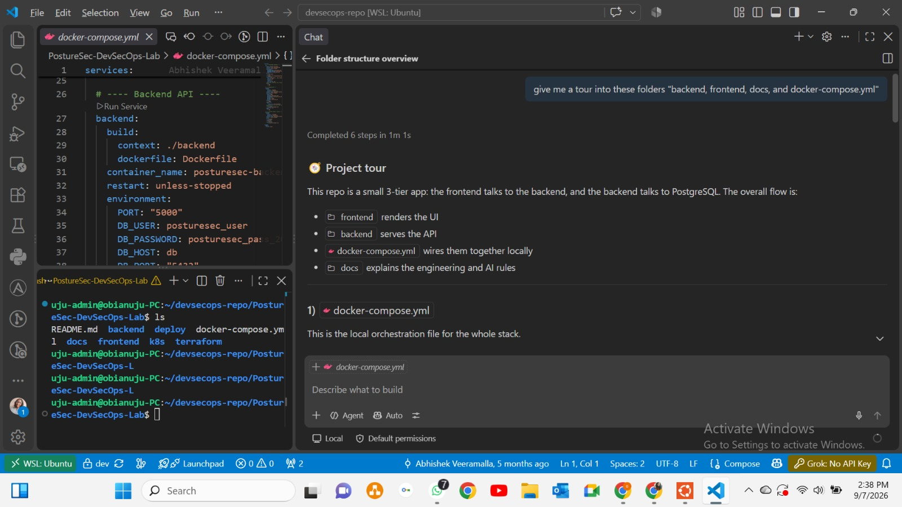
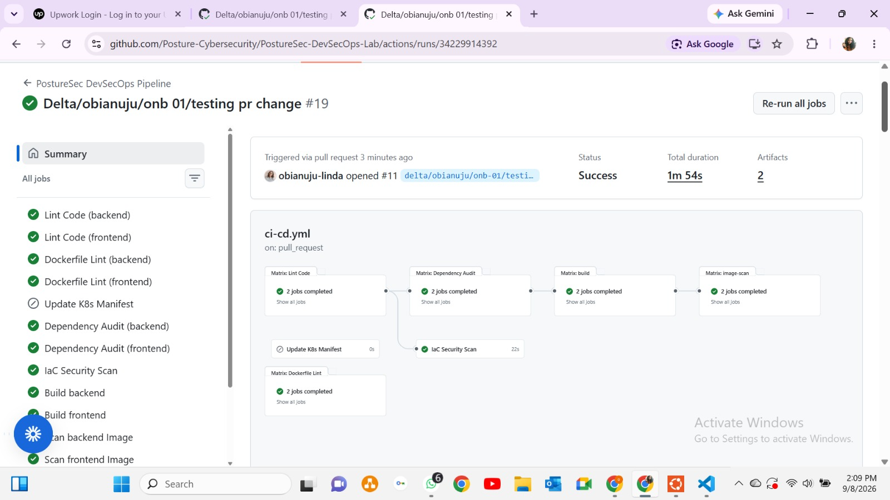

## ONB SPRINT-0
# Task Objective
Get VS Code, the terminal, Node.js 20 and Git working on your machine.
...
...
...

# Acceptance criteria
Editor installed; node --version shows 20.x; git configured with your identity.
...

# task Objective
Clone PostureSec and understand its layout: frontend/, backend/, deploy/, terraform/, k8s/, .github/.
# Acceptance criteria
Repo cloned & authenticated; you can explain what each top-level folder does; latest main pulled.

# Evidence required
Terminal screenshot of the clone + one sentence per top-level folder.
...

...Browser loads  the frontend.
*Frontend calls  on the backend.
*Backend reads/writes data in PostgreSQL
*Docker Compose starts all three pieces together locall
*Docs outline how to work safely and consistently in the project...

...

...